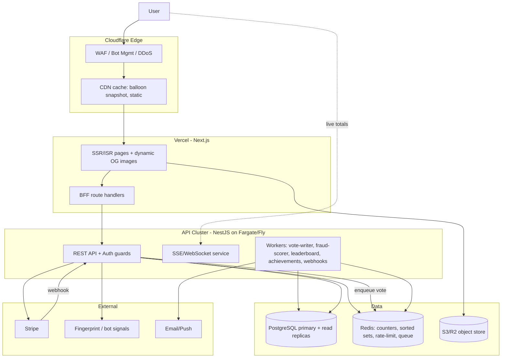

# 01 — System Architecture

## 1. Stack decision

| Layer | Choice | Why |
|---|---|---|
| Frontend | **Next.js 14 (App Router) + TypeScript + Tailwind + Framer Motion** | SSR/ISR for fast first paint + SEO on share pages, dynamic OG images, great animation story for the balloon |
| API | **NestJS (Node.js, TypeScript)** | Structured, modular (guards/interceptors/DI) — fits payments+auth+fraud cleanly; shares TS types with frontend |
| Primary DB | **PostgreSQL** | Relational integrity for users/referrals/wallet/ledger; strong for the money path |
| Cache / counters / rate-limit | **Redis** | Atomic counters for live vote totals, leaderboards (sorted sets), rate limiting, sessions, idempotency keys |
| Async / write durability | **Queue (BullMQ on Redis → or SQS at scale)** | Absorb viral write spikes; vote writes processed async into Postgres |
| Realtime | **SSE (primary) / WebSocket (Phase 2)** | Push live totals to the balloon without hammering the DB |
| Auth | **Auth.js (NextAuth) or Clerk** — Email + Google + social | Fast to ship, social login out of the box |
| Payments | **Stripe** + abstracted `PaymentProvider` port | Add PayPal / Mercado Pago / regional later without touching domain logic |
| Object storage / OG images | **S3/R2 + edge image generation** | Dynamic share-card images |
| CDN / edge / WAF | **Cloudflare** | DDoS protection, bot management, caching, edge rate limiting |
| Hosting | **Vercel (frontend)** + **AWS ECS/Fargate or Fly.io (API)** | Vercel for Next.js DX; containerized API for control over long-lived connections + workers |
| Analytics | **PostHog** (product/funnels) + warehouse (BigQuery/Snowflake) for revenue | Funnels, referral cohort analysis, self-host option |
| Observability | **OpenTelemetry → Grafana/Datadog**, Sentry | Traces across spike events, error tracking |

### Why NestJS over "just Next API routes"
The money + fraud + queue-worker + scheduled-job surface is large and long-lived. A dedicated
API service gives us background workers, WebSocket/SSE servers, and horizontal scaling
independent of the frontend. Next.js still owns rendering, OG images, and a thin BFF layer.

---

## 2. High-level architecture



---

## 3. The vote write path (the part that must not fall over)

The balloon's value depends on a live, believable counter that survives 100× spikes.
We separate **fast acknowledged increment** from **durable persistence**.

```mermaid
sequenceDiagram
  participant C as Client
  participant API as API (Nest)
  participant R as Redis
  participant Q as Queue
  participant W as Vote Writer
  participant PG as Postgres

  C->>API: POST /votes {side, fingerprint, idemKey}
  API->>API: auth + rate-limit + fraud pre-check
  API->>R: INCR counters (side, total) [atomic]
  API->>R: check+set idempotency key
  API->>Q: enqueue durable vote event
  API-->>C: 200 {newTotals, percentages, leader}  (fast path)
  W->>Q: consume
  W->>PG: INSERT vote row + update wallet ledger
  W->>R: post-hoc fraud score; if bad → DECR public counter, quarantine
  Note over R,PG: Periodic reconciliation job aligns Redis cache with PG truth
```

Key properties:
- **Idempotency** keyed on `(userOrFingerprint, day, idemKey)` so retries/double-taps don't double count.
- **Public counter in Redis** is the source for reads (cheap, fast, cached at edge for ~1–2s).
- **Postgres is the durable ledger** of truth; a reconciliation job repairs Redis if it drifts.
- **Fraud is two-phase**: cheap synchronous pre-check (block obvious abuse) + async deep scoring (quarantine after the fact, adjust public counter down).

---

## 4. Read path for the balloon

- `GET /stats/live` returns `{messi, ronaldo, total, leader, tiePct}` from Redis.
- Edge-cached for 1–2 seconds (Cloudflare) → absorbs millions of reads cheaply.
- **SSE channel** pushes deltas so the balloon animates without per-client polling.
- Fallback: client polls every 5s if SSE unsupported.

---

## 5. Service modules (NestJS)

```
src/
  auth/            # email, google, social; JWT/session; device binding
  users/           # profile, username, faction, anon→registered merge
  votes/           # cast vote, daily-allowance, idempotency, counters
  wallet/          # credit balance, ledger, spend/earn
  payments/        # Stripe adapter, PaymentProvider port, webhooks
  referrals/       # code gen, attribution, points, edges
  leaderboards/    # redis sorted sets, periodic snapshots
  gamification/    # achievements rules engine, badges
  fraud/           # fingerprint ingest, scoring, rules, quarantine
  realtime/        # SSE/WebSocket gateway
  stats/           # live + historical aggregates
  admin/           # moderation, manual review queue, kill-switches
  common/          # guards, interceptors, rate-limit, idempotency, config
  workers/         # vote-writer, fraud-scorer, leaderboard-rollup, og-warmer
```

---

## 6. Environments & deploy

- **Branches:** trunk-based, preview deploys per PR (Vercel previews + ephemeral API).
- **Envs:** dev → staging (prod-like, synthetic load) → prod.
- **Secrets:** Doppler/AWS Secrets Manager; never in repo.
- **DB migrations:** Prisma Migrate or TypeORM migrations, forward-only, reviewed.
- **Feature flags:** for paid-voting rollout, balloon variants, anti-fraud thresholds.
- **Kill switches:** disable purchases, disable anon voting, freeze counter — all flag-driven.

---

## 7. Key cross-cutting concerns

| Concern | Approach |
|---|---|
| Idempotency | `Idempotency-Key` header for votes & payments; Redis SET NX with TTL |
| Rate limiting | Edge (Cloudflare) + app (Redis token bucket) per IP / fingerprint / user |
| Config | 12-factor, env-driven, typed config module |
| Type sharing | Shared `packages/contracts` (zod schemas + TS types) used by FE + BFF + API |
| Time | All UTC; "daily vote" window = rolling 24h or calendar-day in user TZ (decide; recommend calendar-day UTC for simplicity + abuse clarity) |
