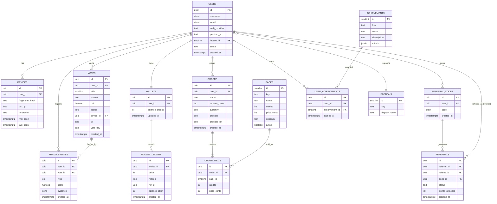

# 02 — Database Schema & ERD

PostgreSQL is the durable source of truth. Redis holds hot counters/leaderboards (not shown as tables).

## 1. ERD



## 2. DDL (core tables)

```sql
-- enable extensions
CREATE EXTENSION IF NOT EXISTS "uuid-ossp";
CREATE EXTENSION IF NOT EXISTS "citext";

-- factions (seed: 1=messi, 2=ronaldo)
CREATE TABLE factions (
  id           SMALLINT PRIMARY KEY,
  key          TEXT UNIQUE NOT NULL,
  display_name TEXT NOT NULL
);

-- users (supports anonymous → registered upgrade)
CREATE TABLE users (
  id            UUID PRIMARY KEY DEFAULT uuid_generate_v4(),
  username      CITEXT UNIQUE,                         -- nullable until claimed
  email         CITEXT UNIQUE,                         -- null for anon
  email_verified BOOLEAN NOT NULL DEFAULT FALSE,
  auth_provider TEXT,                                  -- 'anon'|'email'|'google'|'apple'...
  provider_id   TEXT,
  faction_id    SMALLINT REFERENCES factions(id),     -- set on first vote
  is_anonymous  BOOLEAN NOT NULL DEFAULT TRUE,
  status        TEXT NOT NULL DEFAULT 'active',        -- active|shadowbanned|banned
  country       TEXT,
  created_at    TIMESTAMPTZ NOT NULL DEFAULT now(),
  updated_at    TIMESTAMPTZ NOT NULL DEFAULT now()
);
CREATE UNIQUE INDEX ux_users_provider ON users(auth_provider, provider_id)
  WHERE provider_id IS NOT NULL;

-- devices / fingerprints (many devices per user; a fingerprint may map to many users = signal)
CREATE TABLE devices (
  id               UUID PRIMARY KEY DEFAULT uuid_generate_v4(),
  user_id          UUID REFERENCES users(id),
  fingerprint_hash TEXT NOT NULL,
  last_ip          INET,
  user_agent       TEXT,
  reputation       TEXT NOT NULL DEFAULT 'unknown',    -- good|unknown|suspicious|blocked
  first_seen       TIMESTAMPTZ NOT NULL DEFAULT now(),
  last_seen        TIMESTAMPTZ NOT NULL DEFAULT now()
);
CREATE INDEX ix_devices_fp ON devices(fingerprint_hash);
CREATE INDEX ix_devices_user ON devices(user_id);

-- votes (partitioned by month for scale; see scaling doc)
CREATE TABLE votes (
  id         UUID DEFAULT uuid_generate_v4(),
  user_id    UUID NOT NULL REFERENCES users(id),
  device_id  UUID REFERENCES devices(id),
  side       SMALLINT NOT NULL,                        -- 1=messi 2=ronaldo
  paid       BOOLEAN NOT NULL DEFAULT FALSE,
  source     TEXT NOT NULL DEFAULT 'web',              -- web|referral|campaign
  status     TEXT NOT NULL DEFAULT 'counted',          -- counted|quarantined|reversed
  ip         INET,
  vote_day   DATE NOT NULL,                            -- UTC day for daily-allowance
  created_at TIMESTAMPTZ NOT NULL DEFAULT now(),
  PRIMARY KEY (id, created_at)
) PARTITION BY RANGE (created_at);

-- one FREE vote per user per UTC day:
CREATE UNIQUE INDEX ux_votes_free_daily
  ON votes (user_id, vote_day) WHERE paid = FALSE;
CREATE INDEX ix_votes_user ON votes(user_id);
CREATE INDEX ix_votes_side_status ON votes(side, status);

-- wallet (1:1 with user)
CREATE TABLE wallets (
  id              UUID PRIMARY KEY DEFAULT uuid_generate_v4(),
  user_id         UUID UNIQUE NOT NULL REFERENCES users(id),
  balance_credits INT NOT NULL DEFAULT 0 CHECK (balance_credits >= 0),
  updated_at      TIMESTAMPTZ NOT NULL DEFAULT now()
);

-- append-only ledger (never mutate; balance = sum of deltas)
CREATE TABLE wallet_ledger (
  id            UUID PRIMARY KEY DEFAULT uuid_generate_v4(),
  wallet_id     UUID NOT NULL REFERENCES wallets(id),
  delta         INT NOT NULL,                          -- +credits purchase, -1 per paid vote
  reason        TEXT NOT NULL,                         -- purchase|vote_spend|refund|bonus|reversal
  ref_id        UUID,                                  -- order_id or vote_id
  balance_after INT NOT NULL,
  created_at    TIMESTAMPTZ NOT NULL DEFAULT now()
);
CREATE INDEX ix_ledger_wallet ON wallet_ledger(wallet_id, created_at);

-- packs (seed data)
CREATE TABLE packs (
  id         SMALLINT PRIMARY KEY,
  key        TEXT UNIQUE NOT NULL,                     -- starter|supporter|legend
  name       TEXT NOT NULL,
  credits    INT NOT NULL,
  price_cents INT NOT NULL,
  currency   TEXT NOT NULL DEFAULT 'usd',
  active     BOOLEAN NOT NULL DEFAULT TRUE
);

-- orders + items
CREATE TABLE orders (
  id           UUID PRIMARY KEY DEFAULT uuid_generate_v4(),
  user_id      UUID NOT NULL REFERENCES users(id),
  status       TEXT NOT NULL DEFAULT 'pending',        -- pending|paid|failed|refunded|disputed
  amount_cents INT NOT NULL,
  currency     TEXT NOT NULL DEFAULT 'usd',
  provider     TEXT NOT NULL DEFAULT 'stripe',
  provider_ref TEXT,                                   -- payment_intent id
  risk_score   NUMERIC,
  created_at   TIMESTAMPTZ NOT NULL DEFAULT now(),
  updated_at   TIMESTAMPTZ NOT NULL DEFAULT now()
);
CREATE UNIQUE INDEX ux_orders_provider_ref ON orders(provider, provider_ref)
  WHERE provider_ref IS NOT NULL;

CREATE TABLE order_items (
  id          UUID PRIMARY KEY DEFAULT uuid_generate_v4(),
  order_id    UUID NOT NULL REFERENCES orders(id),
  pack_id     SMALLINT NOT NULL REFERENCES packs(id),
  credits     INT NOT NULL,
  price_cents INT NOT NULL
);

-- referral codes (a user may have one primary; allow many for campaigns)
CREATE TABLE referral_codes (
  id         UUID PRIMARY KEY DEFAULT uuid_generate_v4(),
  user_id    UUID NOT NULL REFERENCES users(id),
  code       CITEXT UNIQUE NOT NULL,
  created_at TIMESTAMPTZ NOT NULL DEFAULT now()
);

-- referral edges (referrer → referee), unique per referee to prevent multi-credit
CREATE TABLE referrals (
  id             UUID PRIMARY KEY DEFAULT uuid_generate_v4(),
  referrer_id    UUID NOT NULL REFERENCES users(id),
  referee_id     UUID NOT NULL REFERENCES users(id),
  code_id        UUID REFERENCES referral_codes(id),
  status         TEXT NOT NULL DEFAULT 'pending',       -- pending|qualified|fraud
  points_awarded INT NOT NULL DEFAULT 0,
  created_at     TIMESTAMPTZ NOT NULL DEFAULT now(),
  CONSTRAINT no_self_referral CHECK (referrer_id <> referee_id)
);
CREATE UNIQUE INDEX ux_referrals_referee ON referrals(referee_id); -- one referrer per person

-- achievements
CREATE TABLE achievements (
  id          SMALLINT PRIMARY KEY,
  key         TEXT UNIQUE NOT NULL,
  name        TEXT NOT NULL,
  description TEXT,
  criteria    JSONB NOT NULL,                          -- rule engine spec
  tier        SMALLINT NOT NULL DEFAULT 1
);
CREATE TABLE user_achievements (
  id             UUID PRIMARY KEY DEFAULT uuid_generate_v4(),
  user_id        UUID NOT NULL REFERENCES users(id),
  achievement_id SMALLINT NOT NULL REFERENCES achievements(id),
  earned_at      TIMESTAMPTZ NOT NULL DEFAULT now(),
  UNIQUE (user_id, achievement_id)
);

-- fraud signals (audit trail; informs quarantine)
CREATE TABLE fraud_signals (
  id         UUID PRIMARY KEY DEFAULT uuid_generate_v4(),
  user_id    UUID REFERENCES users(id),
  vote_id    UUID,
  device_id  UUID REFERENCES devices(id),
  type       TEXT NOT NULL,                            -- velocity|ip_cluster|fp_reuse|ring|...
  score      NUMERIC NOT NULL,
  evidence   JSONB,
  created_at TIMESTAMPTZ NOT NULL DEFAULT now()
);
CREATE INDEX ix_fraud_user ON fraud_signals(user_id);

-- referral stats rollup (materialized for leaderboard; refreshed by worker)
CREATE TABLE referral_stats (
  user_id           UUID PRIMARY KEY REFERENCES users(id),
  invited_count     INT NOT NULL DEFAULT 0,
  qualified_count   INT NOT NULL DEFAULT 0,
  votes_generated   INT NOT NULL DEFAULT 0,
  points            INT NOT NULL DEFAULT 0,
  updated_at        TIMESTAMPTZ NOT NULL DEFAULT now()
);
```

## 3. Counters & leaderboards in Redis

| Key | Type | Purpose |
|---|---|---|
| `votes:public:1` / `votes:public:2` | string (INT) | live Messi / Ronaldo public totals |
| `votes:raw:1` / `votes:raw:2` | string (INT) | internal raw totals (incl. unscored) |
| `lb:referrers` | ZSET | top referrers by points |
| `lb:referrers:messi` / `:ronaldo` | ZSET | per-faction referrer ranks |
| `rl:ip:{ip}` / `rl:fp:{fp}` | string + TTL | rate-limit token buckets |
| `idem:{key}` | string + TTL | idempotency guard |
| `daily:{userId}:{day}` | string + TTL | fast free-vote-used flag |

> Postgres `votes` remains the auditable truth; Redis is rebuildable from it via the reconciliation job.

## 4. Anonymous → registered merge

On signup, the anon `users` row is upgraded in place (`is_anonymous=false`, set email/provider).
Device, votes, wallet, referral edges already point to that user id → **no data migration needed**.
If a user signs up on a *new* device but had an anon identity on another, offer "claim" via the
referral code or a magic link; merge with a `user_merges` audit record (Phase 2).
