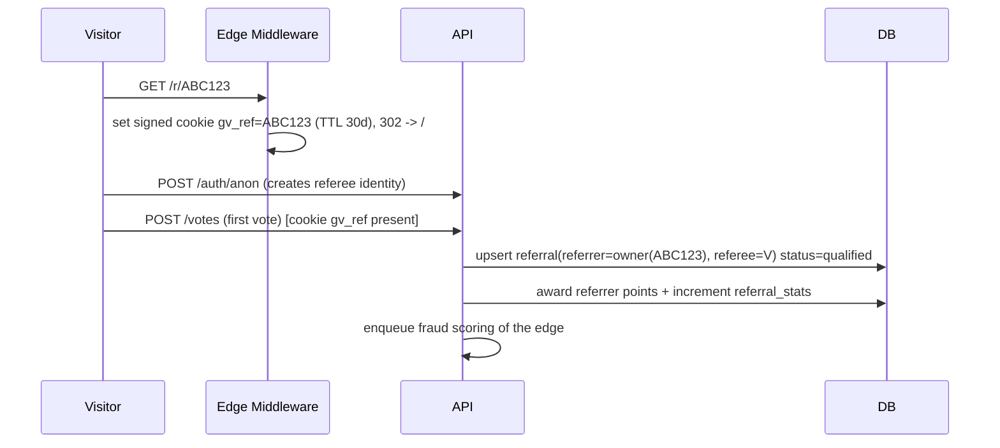

# 05 — Referral Tracking Architecture

## 1. Principles
- **Attribute early, credit late.** Capture the code on landing; only *award* the referrer when the
  referee performs a qualifying action (their first counted vote). Prevents click-farming empty credits.
- **One referrer per person, forever.** First valid attribution wins (`ux_referrals_referee`).
- **No self-referral, no cycles** (`no_self_referral` CHECK + graph guard).
- **Fraud-aware.** Referral edges are scored; rings get demoted to `status='fraud'` and excluded from leaderboards/points.

## 2. Code generation
- Short, unambiguous code: base32 (Crockford), 6 chars → ~1B space, collision-checked.
- Each user gets a primary code on identity creation (even anonymous).
- Campaign codes (Phase 2) allow multiple codes per user for channel tracking.

## 3. Attribution flow

Qualifying action = **first counted (non-quarantined) vote** by the referee.
- If the vote is later quarantined as fraud, the referral reverts to `pending`/`fraud` and points are clawed back via a ledger-style adjustment.

## 4. Points model (tunable)

| Event | Referrer reward |
|---|---|
| Referee qualifies (first real vote) | +10 points, invited_count +1, qualified_count +1 |
| Referee casts additional votes | votes_generated +N (drives "votes generated" metric) |
| Referee makes first purchase | +50 points (high-value action) |
| Multi-level (Phase 2, optional) | tier-2 gets 10% of tier-1 points; capped depth=2 to limit pyramid dynamics |

> Keep MLM depth shallow (≤2) and disclosed to avoid pyramid-scheme optics/regulatory issues.

## 5. Anti-fraud for referrals (summary; full detail in 07)
- Same-device referrer↔referee → reject.
- IP/subnet clustering of a referrer's referees → score up, possible quarantine.
- Referees who never return / vote once and vanish in bulk → ring signal.
- Velocity: N qualified referrals in M minutes beyond human plausibility → review.
- Disposable-email / known-VPN exit-node weighting.

## 6. Data surfaces
- `referral_stats` materialized table → fast personal page + leaderboard.
- Redis ZSET `lb:referrers` (+ per faction) for live ranking; periodic rebuild from `referral_stats`.
- `GET /referrals/me` returns code, link, invited, qualified, votesGenerated, points, rank.

## 7. Leaderboard ranking key
`points DESC, qualified_count DESC, votes_generated DESC, earliest_qualified ASC` (tiebreak rewards early movers).
