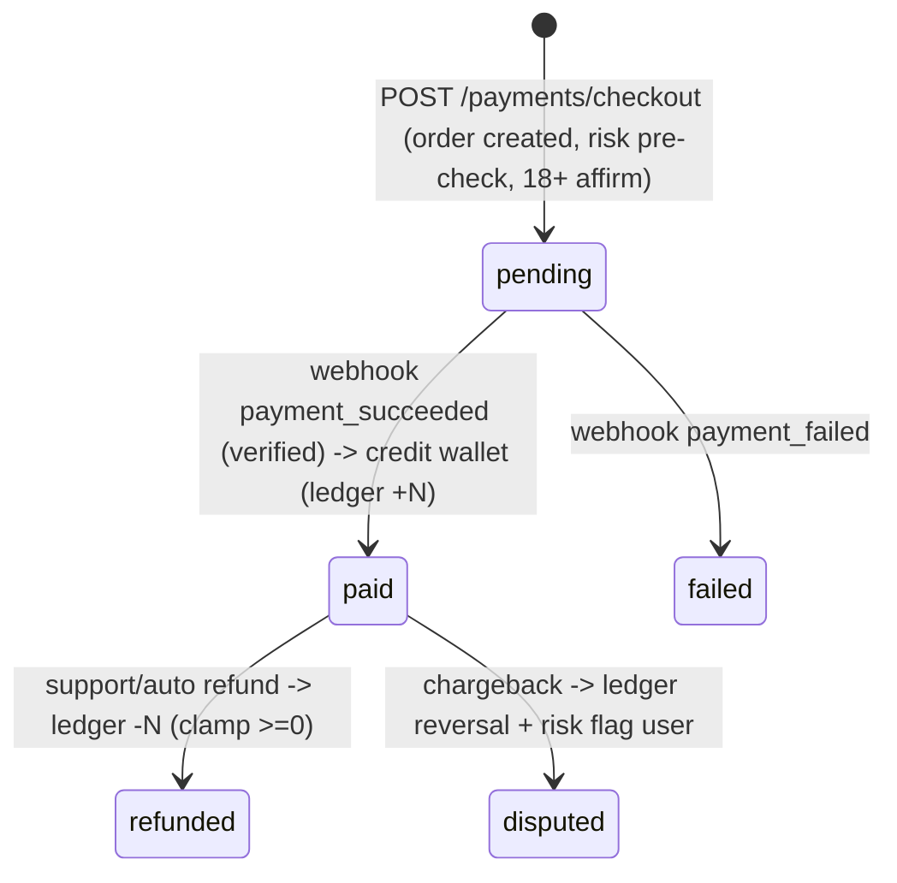

# 06 — Payment Architecture

## 1. Goals
- Sell vote packs reliably and idempotently.
- Pluggable PSPs (Stripe now; PayPal, Mercado Pago, regional later) without touching domain logic.
- Server-authoritative pricing, ledgered credits, chargeback-resilient, compliant disclosure.

## 2. Provider abstraction (port/adapter)

```ts
interface PaymentProvider {
  createCheckout(input: { order: Order; pack: Pack; user: User }):
    Promise<{ clientSecret?: string; redirectUrl?: string; providerRef: string }>;
  verifyWebhook(req: RawRequest): Promise<WebhookEvent>;   // signature verification
  refund(providerRef: string, amountCents: number): Promise<RefundResult>;
}
```
Adapters: `StripeProvider` (v1), `PaypalProvider`, `MercadoPagoProvider` (later).
Domain code only knows `PaymentProvider`. Provider chosen by user region / config / flag.

## 3. Purchase lifecycle (idempotent + ledgered)



Rules:
- **Wallet is credited only on verified webhook**, never on client callback.
- Credit application is **idempotent** on `provider_ref` (`ux_orders_provider_ref`) — webhook retries can't double-credit.
- Every credit/debit writes a `wallet_ledger` row with `balance_after`; the wallet balance is derivable/auditable.
- Spending a paid vote: atomic `wallet.balance -= 1` + ledger `reason='vote_spend'` in one transaction with the vote write.

## 4. Pricing & packs
- Prices live in DB (`packs`) — server is the only source of truth; client never sends amounts.
- Multi-currency: store price per currency or convert via configured FX; show local currency at checkout.
- Pack mix designed to anchor (Starter cheap entry, Legend as the "whale" tier).

## 5. Fraud / risk on payments
- Stripe **Radar** rules + 3D Secure (SCA) enforced for EU.
- Velocity caps: max N purchases / hour / user; cooldown after a failed-then-success pattern.
- Mismatch checks: billing country vs IP/fingerprint geo → elevate risk_score.
- New account + immediate Legend Pack + VPN → manual review hold before crediting (configurable).
- Disposable card / prepaid BIN weighting.

## 6. Disclosure & consumer protection
- Mandatory copy at checkout & footer:
  *"Paid votes are part of the entertainment experience and are included in the public total."*
- Show pack contents, total price, currency, and that **credits are consumable digital goods**.
- EU: present the right-of-withdrawal waiver for immediate digital delivery (user consents to immediate
  performance and acknowledges loss of withdrawal right) — implement per legal guidance.
- Refund policy page; support flow with `refund` adapter; refunds clamp wallet ≥ 0 and reverse any
  achievements/leaderboard impact that the refunded credits produced.

## 7. Reconciliation & finance
- Daily job reconciles Stripe payouts/balance vs `orders`/`wallet_ledger`.
- Export to warehouse for revenue metrics (gross, net, refunds, chargeback rate, ARPPU).
- Tax: use Stripe Tax for VAT/sales tax handling; store tax breakdown on the order.

## 8. PCI scope
- Use Stripe Elements / hosted Checkout — card data never touches our servers (SAQ-A scope).
- Webhook endpoints verify signatures; secrets in a vault; raw body preserved for signature check.
