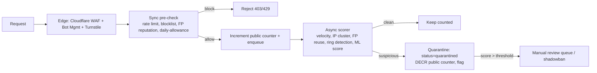

# 07 — Anti-Fraud / Anti-Abuse Architecture

The credibility of the public counter is the whole product. Fraud defense is layered:
**Edge → Synchronous pre-check → Asynchronous deep scoring → Manual review.**

## 1. Threat model

| Threat | Description |
|---|---|
| Bots / scripts | Automated mass voting via headless browsers / direct API hits |
| Fake accounts | Throwaway emails / OAuth churn to farm free daily votes |
| Vote farming | Same human/device cycling identities for one side |
| Referral fraud | Self-referral rings, fake referees to climb leaderboard |
| Payment fraud | Stolen cards, chargebacks, prepaid-card abuse |
| Sybil / coordinated | Botnets across many IPs simulating organic growth |

## 2. Signals collected (disclosed in privacy policy)

| Signal | Source |
|---|---|
| Device fingerprint | Client SDK (canvas/audio/WebGL entropy, FP token). Consider FingerprintJS/commercial for high-confidence IDs |
| IP + ASN + geo | Request metadata; flag datacenter/VPN/Tor ASNs |
| Behavioral | Request timing, mouse/touch entropy, time-on-page before vote, navigation path |
| Account graph | email domain, OAuth provider age, referral edges |
| Velocity | votes/min per IP, fingerprint, subnet, referral chain |
| Challenge | Cloudflare Turnstile / hCaptcha (invisible, escalate on suspicion) |

## 3. Layered enforcement

### Layer details
1. **Edge (Cloudflare):** DDoS, bot fingerprinting, Turnstile challenge on risky scores, edge rate limits per IP. Cheapest place to drop garbage.
2. **Synchronous pre-check (API guard):**
   - Token-bucket rate limit (Redis) per IP / fingerprint / user.
   - Device/fingerprint reputation lookup (`blocked` → reject).
   - Daily free-vote allowance check (`daily:{user}:{day}` + unique index backstop).
   - Reject obvious abuse with `403`/`429` and **no counter change**.
3. **Asynchronous deep scoring (worker):**
   - Velocity anomalies (per IP/subnet/fingerprint/referral chain).
   - **IP clustering:** many "distinct" users from one /24 or ASN in a short window.
   - **Fingerprint reuse:** one fingerprint mapping to many user ids = farming.
   - **Referral ring detection:** graph analysis (referees share device/IP, vote once, never return).
   - ML/heuristic risk score → `fraud_signals` row. Above threshold → quarantine (decrement public counter, set `votes.status='quarantined'`), claw back referral points.
4. **Manual review & action:** admin queue; ban/shadowban; counter-freeze kill switch.

## 4. Dual-counter design
- **`votes:raw`** = everything accepted at the edge.
- **`votes:public`** = raw minus quarantined/reversed. This is what users see.
- Async scoring decrements `public` when it quarantines. Periodic reconciliation recomputes both from Postgres `votes` by `status`.
- **Shadowbanning:** abusive users keep "voting" (their UI updates) but their votes write `status='quarantined'` and never hit the public counter — removes incentive to evade.

## 5. Referral fraud specifics
- Block referrer==referee device/IP.
- Penalize bursty referral chains; require referee retention (e.g., vote on ≥2 distinct days) before full points vest, partial on first vote.
- Cap daily referral points to limit ring payoff.

## 6. Payment fraud
See `docs/06-payments.md` §5 — Radar, 3DS, velocity caps, geo-mismatch, manual hold for high-risk first purchases.

## 7. Recommendations for scalable abuse prevention
- **Risk-based escalation**, not blanket friction: keep the happy path frictionless; only challenge when score rises (protects virality).
- **Offline + online scoring split:** cheap sync rules inline; expensive graph/ML async — keeps vote latency low.
- **Feedback loop:** confirmed-fraud labels (manual review, chargebacks) retrain/ tune thresholds.
- **Privacy-respecting:** disclose fingerprinting, allow data requests/deletion (GDPR), minimize retention of raw IPs (hash + TTL).
- **Transparency badge:** publish "verified votes" methodology to build trust; show free-vote-only split alongside the total so paid influence is visible.
- **Honeypots:** hidden vote endpoints/fields that only bots hit → instant block list.
- **Graceful degradation:** under attack, raise challenge rate and tighten limits via flags without code deploy.
