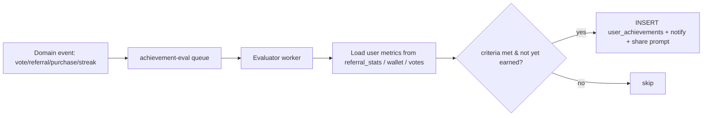

# 08 — Gamification Architecture

## 1. Objective
Convert one-time voters into recurring recruiters via identity, progress, and competition.
Gamification must reinforce the **viral loop** (invite) and **retention loop** (daily vote), not just vanity.

## 2. Mechanics overview

| Mechanic | Drives |
|---|---|
| Factions (Messi/Ronaldo Supporter) | Identity, tribalism, repeat engagement |
| Achievements / badges | Goal-setting, completion, share triggers |
| Points & ranks | Competition, leaderboard climbing |
| Streaks (daily vote) | Habit / retention |
| Progress bars | "Almost there" pull toward next badge |
| Titles (Ambassador, Legend) | Status, displayed on share page |

## 3. Achievement catalog (seed)

| Key | Name | Criteria | Tier |
|---|---|---|---|
| `first_vote` | First Vote | cast 1 vote | 1 |
| `daily_streak_7` | Loyal Supporter | 7-day vote streak | 2 |
| `invite_1` | Recruiter | 1 qualified referral | 1 |
| `invite_10` | Squad Builder | 10 qualified referrals | 2 |
| `votes_100` | Vote Machine | 100 votes generated (self+referred) | 2 |
| `ambassador` | GOAT Ambassador | 50 qualified referrals OR top 1% referrers | 3 |
| `legend_supporter` | Legend Supporter | purchase Legend Pack | 3 |
| `faction_mvp` | Faction MVP | #1 referrer of your faction (snapshot) | 4 |
| `early_adopter` | Day One | joined in launch window | 1 |

## 4. Rules engine
- Each achievement stores `criteria` as JSONB (declarative): `{ "metric":"qualified_referrals", "op":">=", "value":10 }` or composite `{ any|all: [...] }`.
- An **evaluator** runs on relevant domain events (vote cast, referral qualified, purchase succeeded, streak tick).
- Evaluation is **event-driven** (enqueued after the triggering write) → idempotent insert into `user_achievements` (UNIQUE user+achievement).
- On award: push notification / in-app toast + unlock share prompt ("You earned GOAT Ambassador — flex it").

## 5. Points vs achievements
- **Points** (in `referral_stats.points`) feed the leaderboard ranking and are continuous.
- **Achievements** are discrete unlocks; some grant bonus points or wallet credits (careful: credits affect public total → treat bonus credits as flagged `paid=false` promo, disclosed).

## 6. Progression & display
- Share page + `/me` show: faction, title, badge shelf (earned + locked w/ progress bar), rank, streak flame.
- "Next badge: 3 more invites" nudges = top conversion driver for the recruiter persona.

## 7. Anti-abuse alignment
- Achievements key off **qualified** (fraud-screened) metrics only — quarantined votes/fake referrals don't count.
- Clawback: if referrals/votes are reversed as fraud and drop the user below a threshold, revoke the badge (and any granted bonus) to keep leaderboards honest.

## 8. Seasonal / events (Phase 2+)
- Weekly "push" events (double referral points weekend), faction war seasons with reset leaderboards, limited-time badges to re-trigger virality after the initial spike decays.
