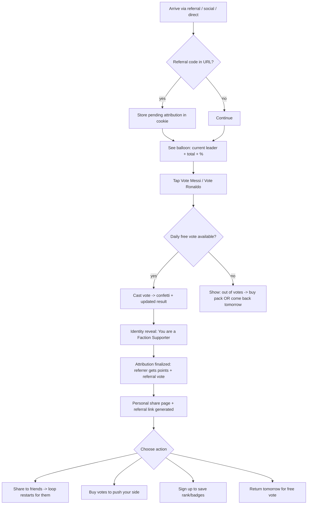
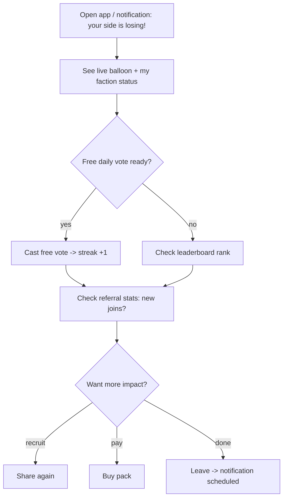
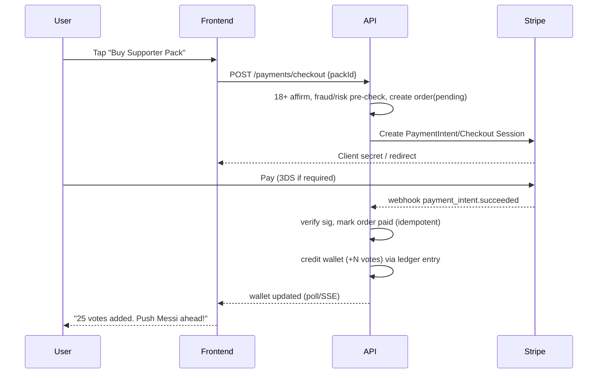
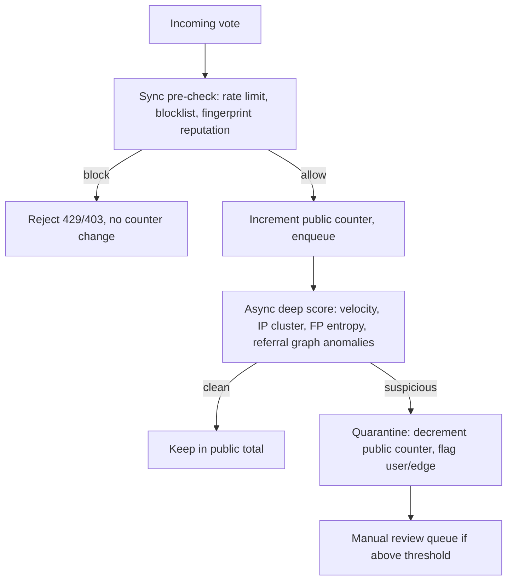

# User Journey Diagrams

## 1. First-time visitor (the viral loop)

```mermaid
flowchart TD
  A[Arrive via referral / social / direct] --> B{Referral code in URL?}
  B -- yes --> C[Store pending attribution in cookie]
  B -- no --> D[Continue]
  C --> E[See balloon: current leader + total + %]
  D --> E
  E --> F[Tap Vote Messi / Vote Ronaldo]
  F --> G{Daily free vote available?}
  G -- yes --> H[Cast vote -> confetti + updated result]
  G -- no --> I[Show: out of votes -> buy pack OR come back tomorrow]
  H --> J[Identity reveal: You are a Faction Supporter]
  J --> K[Attribution finalized: referrer gets points + referral vote]
  K --> L[Personal share page + referral link generated]
  L --> M{Choose action}
  M --> N[Share to friends -> loop restarts for them]
  M --> O[Buy votes to push your side]
  M --> P[Sign up to save rank/badges]
  M --> Q[Return tomorrow for free vote]
```

## 2. Returning user (retention loop)

```mermaid
flowchart TD
  A[Open app / notification: your side is losing!] --> B[See live balloon + my faction status]
  B --> C{Free daily vote ready?}
  C -- yes --> D[Cast free vote -> streak +1]
  C -- no --> E[Check leaderboard rank]
  D --> F[Check referral stats: new joins?]
  E --> F
  F --> G{Want more impact?}
  G -- recruit --> H[Share again]
  G -- pay --> I[Buy pack]
  G -- done --> J[Leave -> notification scheduled]
```

## 3. Purchase flow

```mermaid
sequenceDiagram
  participant U as User
  participant FE as Frontend
  participant API as API
  participant S as Stripe
  U->>FE: Tap "Buy Supporter Pack"
  FE->>API: POST /payments/checkout {packId}
  API->>API: 18+ affirm, fraud/risk pre-check, create order(pending)
  API->>S: Create PaymentIntent/Checkout Session
  S-->>FE: Client secret / redirect
  U->>S: Pay (3DS if required)
  S-->>API: webhook payment_intent.succeeded
  API->>API: verify sig, mark order paid (idempotent)
  API->>API: credit wallet (+N votes) via ledger entry
  API-->>FE: wallet updated (poll/SSE)
  FE-->>U: "25 votes added. Push Messi ahead!"
```

## 4. Anti-fraud decision

```mermaid
flowchart TD
  V[Incoming vote] --> P[Sync pre-check: rate limit, blocklist, fingerprint reputation]
  P -- block --> X[Reject 429/403, no counter change]
  P -- allow --> C[Increment public counter, enqueue]
  C --> S[Async deep score: velocity, IP cluster, FP entropy, referral graph anomalies]
  S -- clean --> K[Keep in public total]
  S -- suspicious --> Q[Quarantine: decrement public counter, flag user/edge]
  Q --> R[Manual review queue if above threshold]
```
